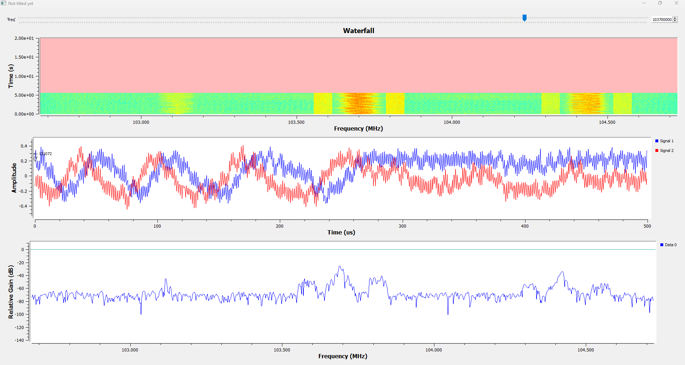

# **GNU Radio**

Figure 1 GNU Radio Flow for the Pluto SDR

Figure 2 GNU Radio output for FM radio

As a proof of concept, the team set up a websocket on the PYNQ-Z2 FPGA running in Python.  Parts of this code came from using generative AI and GNU Radio documentation.

[GNU Radio Websocket Python Block](https://github.com/Eskdagoat/Qorvo_F24_SD/blob/main/GNU_Radio/Pluto_RX_FM/LED_Test_epy_block_1.py)
