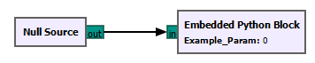
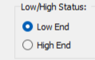
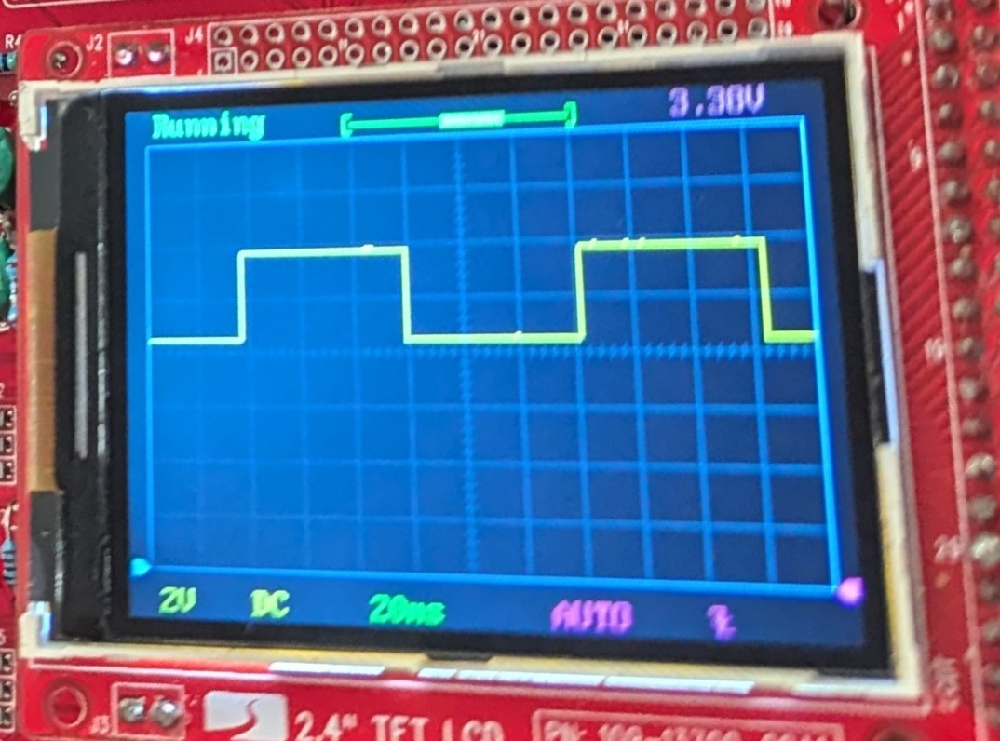

# **PYNQ-Z2 Testing**

The Computer team tested with a PYNQ-Z2 FPGA which has a Zynq 7000 series chip similar to the Eclypse Z7.

## Proof of Concept for GNU Radio Control

First the team used the Python interperter on the PYNQ to show a proof of concept of controlling an output on an FPGA controlled by GNU Radio.  Generative AI was used to assist with the creation of code.  On the FPGA we used a web socket and listened over TCP port 1005 for "LED ON" or "LED OFF" to be recived.  Once recived the FPGA would turn the LED on or off.
In the GNU Radio Block we hard coded the IP address for the FPGA and TCP port listening for the web socket.  In the future this will be set with a GNU Radio variable.

[PYNQ FPGA Python Code](https://github.com/Eskdagoat/Qorvo_F24_SD/blob/main/GNU_Radio/Pynq/PYNQ_LED_Listner.py)

[GNU Radio Python Block to Control LED](https://github.com/Eskdagoat/Qorvo_F24_SD/blob/main/GNU_Radio/Pynq/LED_Test_epy_block_1.py)

[GNU Radio Configuration File](https://github.com/Eskdagoat/Qorvo_F24_SD/blob/main/GNU_Radio/Pynq/LED_Test.grc)

Figure 1 - GNU Radio Python Block

Figure 2 - GNU Radio Control Button

## Proof of Concept for PLL Output

Next a PLL signal was output from the PMOD on the PYNQ to test the feasability of outputing a clock over PMOD ports.  The guide linked below was used as a starting place.
[A PYNQ-Z2 Guide for Absolute Dummies — Part III: Configuring the FPGA Clock](https://blog.umer-farooq.com/a-pynq-z2-guide-for-absolute-dummies-part-iii-tick-tock-using-fpga-clock-33a34ef3f51a)

Figure 3 Sample PLL Output from PYNQ
