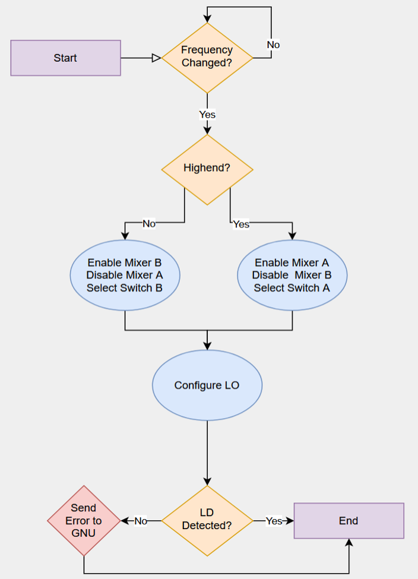
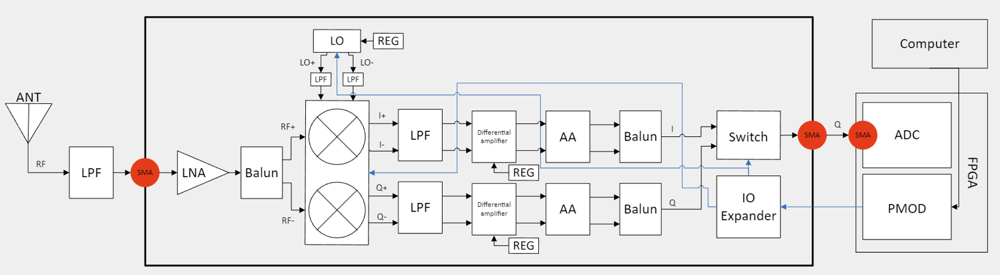
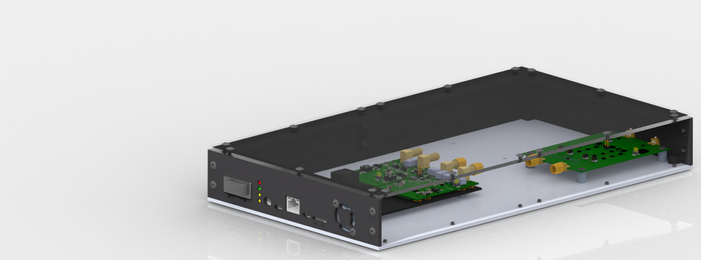

# **QORVO_RADIO**
### Objective
Design and Develop a modular and reconfigurable Software Defined Radio (SDR) platform to support future student projects, ensuring a flexible and adaptive environment.
### Key Functionality 
* Facilitate simultaneous testing of multiple RF modules with independent digital control. 
* Operate at a frequency range of 85-2500 MHz, featuring dual receive (Rx) channels. 
* Provide seamless interaction between hardware and software via a USB interface. 

## Computer Engineering

### FPGA and Control System Integration
* Flexibility: Dynamic reconfiguration support. 
* Connectivity: GNU Radio for user-defined control. 
* Precision: Stable high-quality RF performance. 
* Reliability: Low-latency communication. 
* Expansion: Modular design for hardware enhancement. 

### Design Analysis
* Designed a GNU Radio flow to provide both audio and visual representations of received signals. 
* Validated output using the Pluto SDR platform. 
* Successfully verified GNU based FPGA control. 

### Signal Flow and Control Architecture
* Comprehensive end-to-end signal processing architecture, from user inputs to RF signal generation and reception.
* Emphasizes modularity to enable updates and/or additions for future system enhancements.

### Links
[Eclypse Z7 FPGA Testing](Computer/Eclypse/Eclypse_Testing.MD)

[GNU Radio](GNU_Radio/GNU_Radio.MD)

[PYNQ-Z2 Test FPGA](PYNQ/PYNQ_Testing.MD)

## Electrical Engineering

### Design Considerations
* Schematic: The design includes two Rx paths, separated into high and low frequency ranges to simplify component selection and optimize signal processing. 
* PCB: RF paths are isolated from power and ground layers to minimize noise and prevent signal attenuation across critical layers. 
* Mixers and LO:
    * Quadrature modulation is employed, ensuring compliance with the 40 MHz bandwidth requirement. 
    * Featuring A and B paths, the LO enables simultaneous control of both signal chains with a single LO. 
* Filtering: Low-pass filters, with s cutoff frequency of 50 MHz, configured to provide (Vcm) for the differential amplifier.
* Signal Chain: Comprehensive signal chain analysis was performed to mitigate distortion or clipping before the ADC stage, preserving signal integrity during digitization.

### HCC512-AG Power Supply
* Output: 5 VDC, 12 VDC V, 60 W
* Linear, Stable, low output ripple

### Block Diagram

### Links

## Mechanical Engineering

### CAD Model
* Standard rack size
* Aluminum base plate for grounding 
* 3D Printed Walls
* Plexiglass lid for accessibility
* User interface

### Links

## Implementation Plans for Senior Design 2
* Procure components and fabricate the enclosure. 
* Manufacture the RF front-end PCB to design.
* Program the FPGA for to control the RF front end.
* Conduct rigorous testing to verify compliance with operational specifications.
* Refine code for enhanced performance of the software-defined radio system.
* Deliver a fully functional, modular, and reconfigurable SDR platform.

