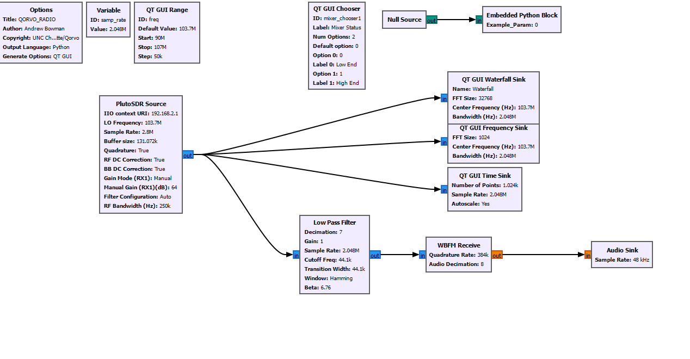
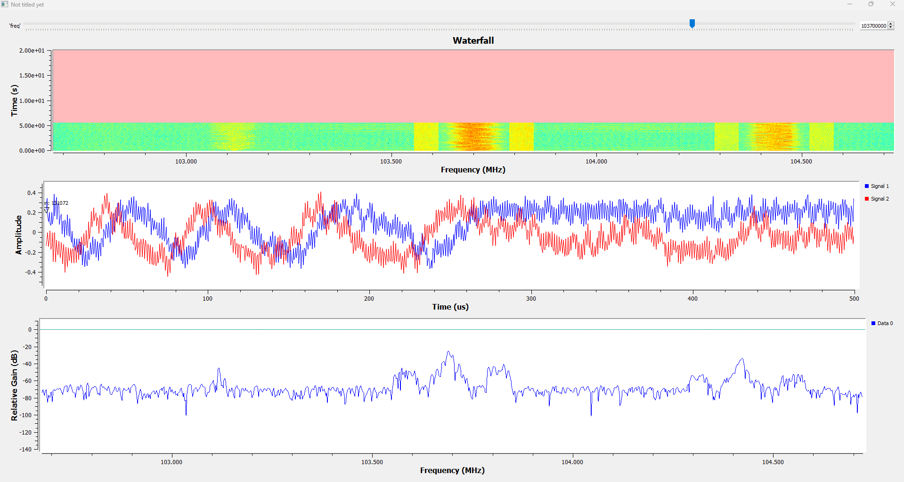

# **GNU Radio**

# Setup for Eclypse Z7
This is assuming you are using a Windows system.  If you are using a Linux system, it should be easier.  https://www.hackster.io/whitney-knitter/getting-started-with-the-sdr-zmod-on-eclypse-z7-gnu-radio-24bdd3
1. Copy Eclypse Z7 GNU Radio Blocks to C:\Users\*Username*\radioconda\Library\share\gnuradio\grc\blocks
2. Copy eclypse_z7.py to C:\Users\*Username*\radioconda\Lib\site-packages

# Sample with Pluto

Figure 1 GNU Radio Flow for the Pluto SDR

Figure 2 GNU Radio output for FM radio

As a proof of concept, the team set up a websocket on the PYNQ-Z2 FPGA running in Python.  Parts of this code came from using generative AI and GNU Radio documentation.  The websocket works by sending a text string of 'LED ON' or 'LED OFF' to a specific IP Address and TCP port on the FPGA.

[GNU Radio Websocket Python Block](https://github.com/Eskdagoat/Qorvo_F24_SD/blob/main/GNU_Radio/Pluto_RX_FM/LED_Test_epy_block_1.py)
